# Assemble the fluidics

*** pic fluidics before

## Assemble flow cell {pagestep}

>! **Caution** 
>!
>! Take care not to damage sealing surfaces (barbs, o-ring grooves, o-rings, cuvette ends). Use plastic tweezers when holding o-rings (not fingers or metal tools).
>! 
>! Wear gloves to handle the cuvette: don't contaminate it with fingerprints.
>! 

First remove the printed supports from the flow cell. Take care not to damage the barb connectors.

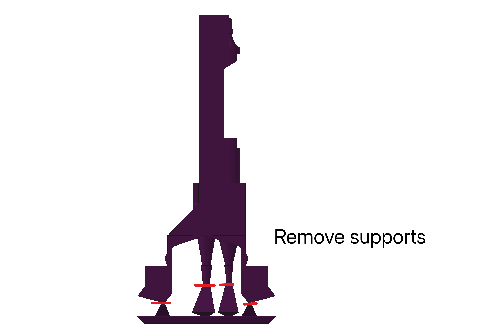
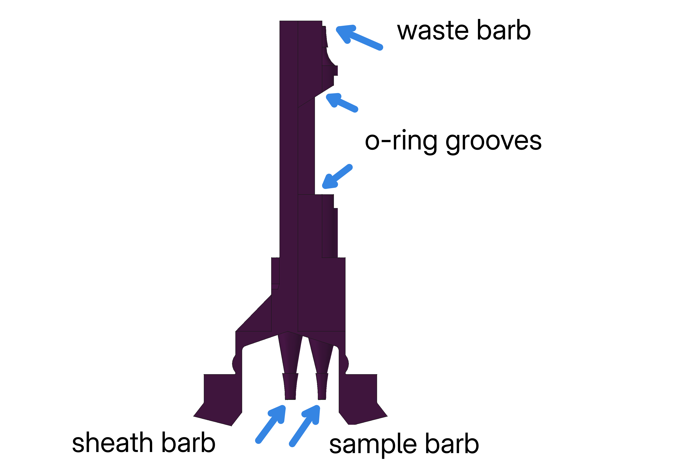

Second, insert the o-rings at either end within the o-ring grooves. If handled gently, the o-rings should stay inside the grooves, due to a slight printed overhang. 

Thirdly flex the flow cell slightly as shown below to insert the cuvette between the o-rings. Tip: if using a square cuvette, you should be able to see through the cuvette side (with a magnifying glass) that the o-ring is sealing against the surface.

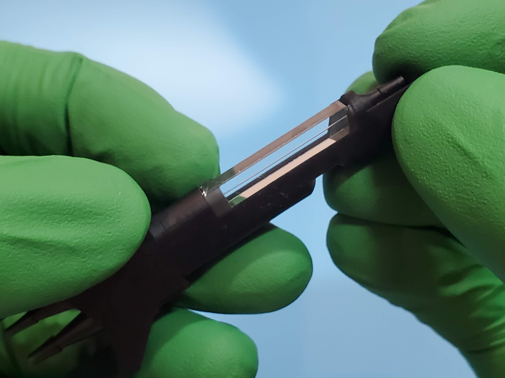
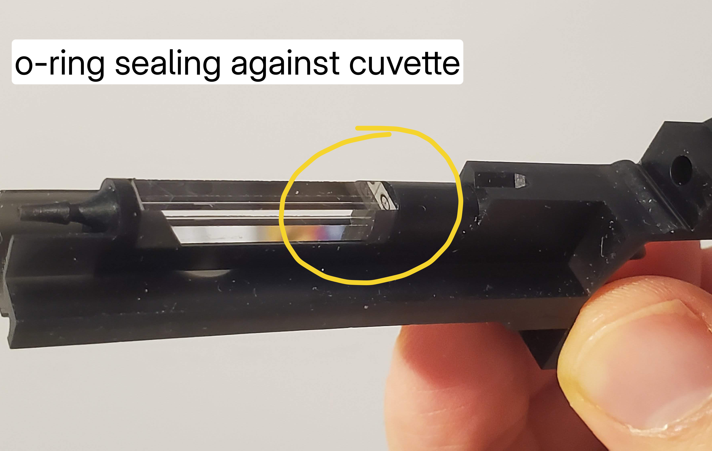
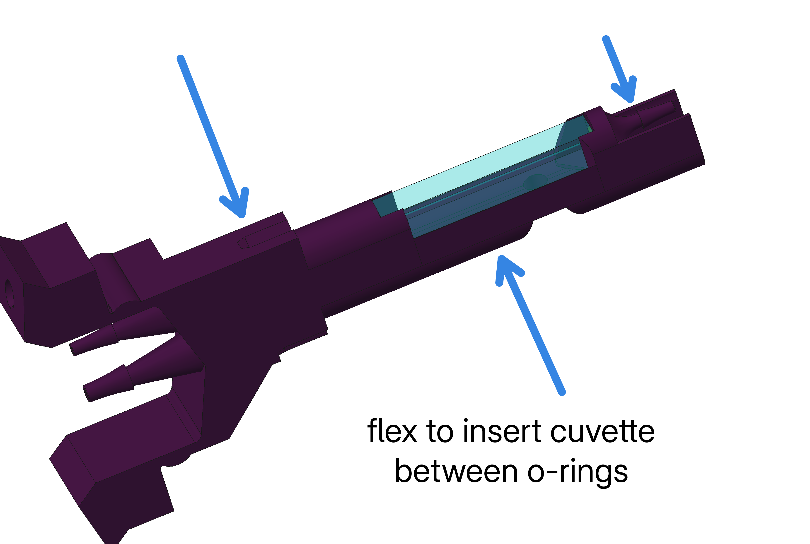

Note how the flow cell works and how it will interface with the optics. Inside the flow cell is a sheath flow chamber with concentric sheath and sample inputs. The laser beam enters and leaves through opposite faces of the cuvette, with fluorescence (and SSC) collected by a condensing lens at 90 degrees, and a camera viewport for alignment opposite the condensing lens.

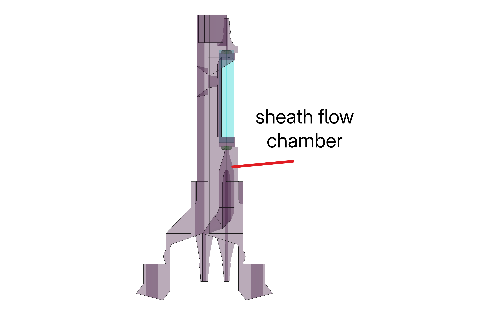
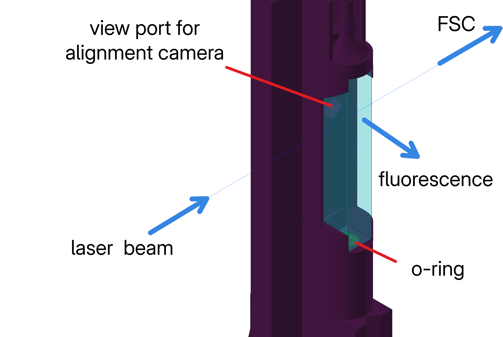

## Prepare sheath and waste tanks {pagestep}

The caps of the sheath and waste tanks must first be drilled with the right size holes to fit the required tubing connections. Take care to drill cleanly, especially the waste tank cap, as these holes must seal against a vacuum (after fitting with silicone tubing).

**Sheath tank cap:**

1. 5 mm hole (sheath tube), 
1. 1.5 mm hole (vent)

**Waste tank cap:**

1. 3.5 mm hole (vacuum pump) 
1. 3.5 mm hole (pressure sensor or vent)
1. 3 mm hole (waste tube)

Attach the following fitings and tubing to the caps

**Sheath tank cap:**
1.

**Waste tank cap:**

1. For waste stream: [Tube barb union 1.6x2.4](fluidic/tube_barb_union1.6x2.4.md){qty:1, cat:fluidics} + 700 mm of [Silicone tubing 2 mm OD 1 mm ID](fluidic/silicone_tubing_1mm.md){cat:fluidics}
1. For pressure sensor or vent: [Tube barb union 1.6x3.2](fluidic/tube_barb_union1.6x3.2.md){qty:1, cat:fluidics} + 400 mm of [Silicone tubing 3.2 mm OD 1.6 mm ID](fluidic/silicone_tubing_1.6mm.md){cat:fluidics}
1. For vacuum pump: [Tube barb union 1.6x3.2](fluidic/tube_barb_union1.6x3.2.md){qty:1, cat:fluidics} + 400 mm of [Silicone tubing 3.2 mm OD 1.6 mm ID](fluidic/silicone_tubing_1.6mm.md){cat:fluidics}

** pic drilled caps
** pic sheath fitted with filter, barbs and tubing
** pic waste fitted with barbs and tubing

## Prepare and assemble sample loader  {pagestep}

The sample loader is a linkage of several mechanical bodies that are printed in a single piece. Before using, it must be loosened and lubricated. 

To loosen the hinges, apply pressure to the two sets of adjacent hinges as shown. The outer hinges down and the middle hinge up. Alternate between the two sets. If printed well, very little pressure applied with the fingers should be required to loosen the hinges. Once the linkage is loose, add light lubricating oil to the hinges. Then work the linkage back and forth repeatedly until it can move with very little friction. 

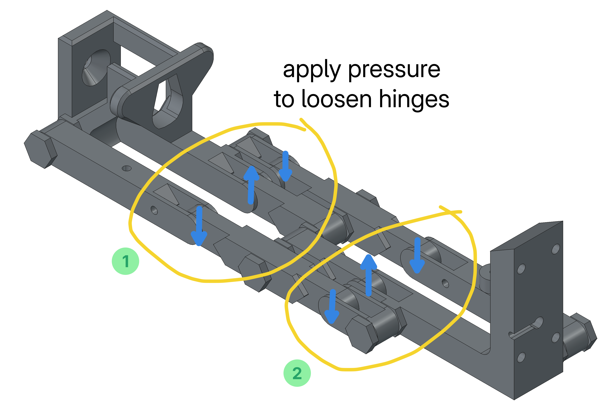
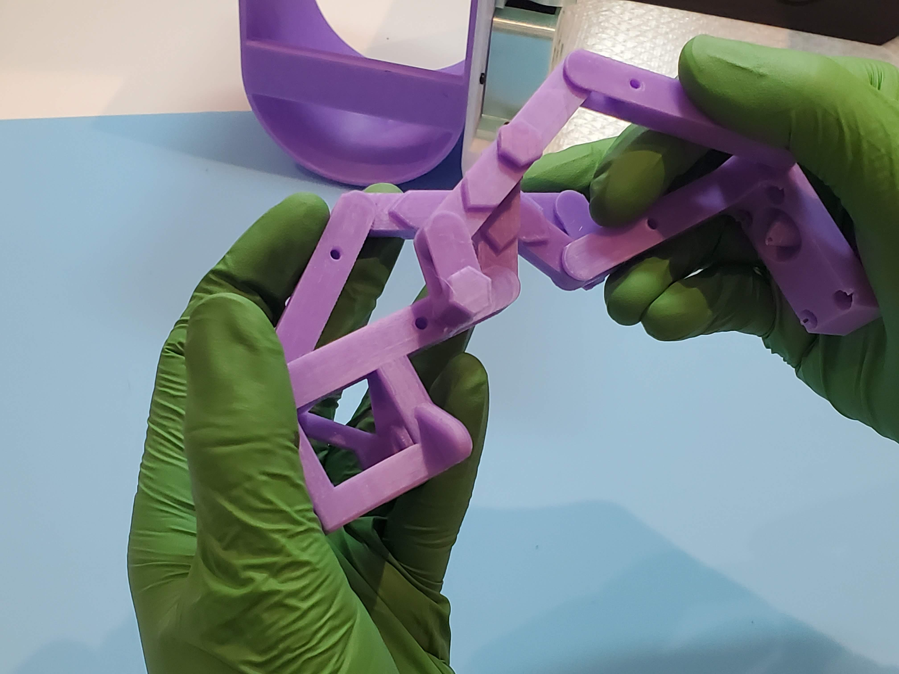

Attach the two sample loader range limiters to the holes as shown using 2x [M3 self-tapping posi head screws 8 mm](mechanical/screws.yaml#self_tapping_m3x8_posi){qty:2, cat:mechanics}.

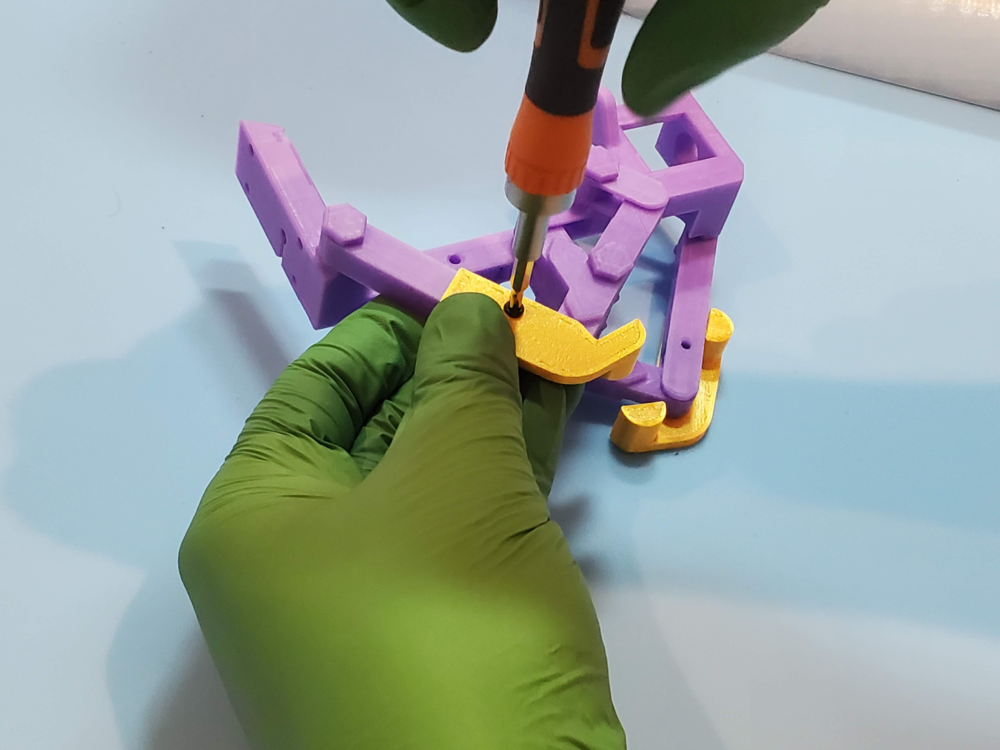
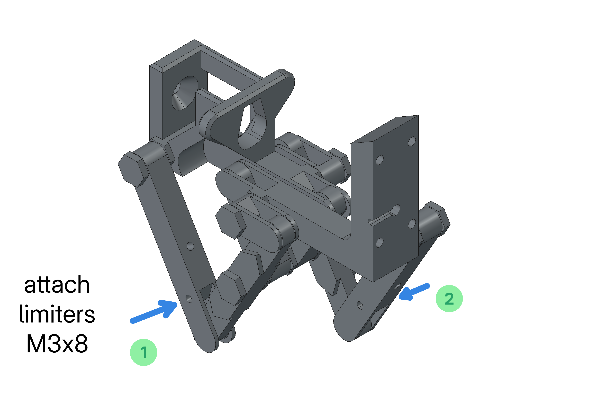

Finally, check that the SIP tube will fit in the sample loader: you may need to carefully ream the hole with a 1.6 mm drill bit. The SIP tube is a 78 mm length of [Peek tubing 1.6mm OD 0.25mm ID](fluidic/peek_tubing.md){qty:1, cat:fluidics}. Cut the required length, straighten it if it was supplied curved, and gentle push it into the hole provided.

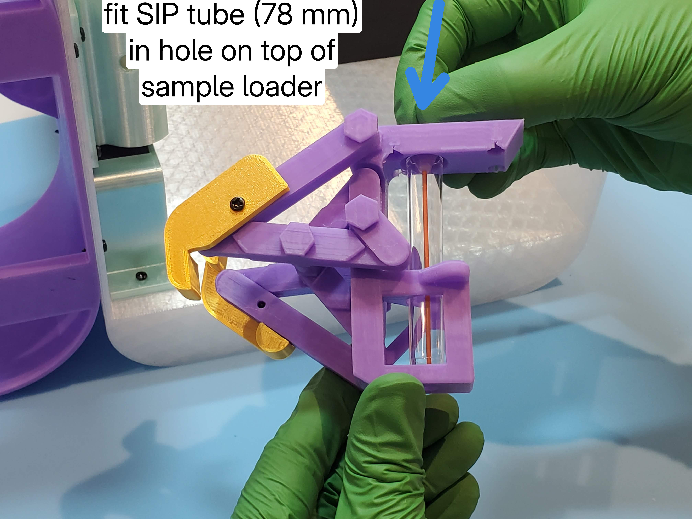

>i **How the sample loader works** 
>i
>i The sample loader is based on a [Kempe Kite Inversor 2](https://www.thingiverse.com/thing:7035940) which is a parallel line linkage: it allows a single degree of freedom, while keeping the SIP and sample tube parallel to each other.
>i
>i 

## Prepare sample (peristaltic) pump assembly  {pagestep}

First fit the barb connectors to the tubing supplied inside the peristaltic pump. Second, fit the stepper motor connector board to the pump, and ribbon cable to the stepper motor connector board.

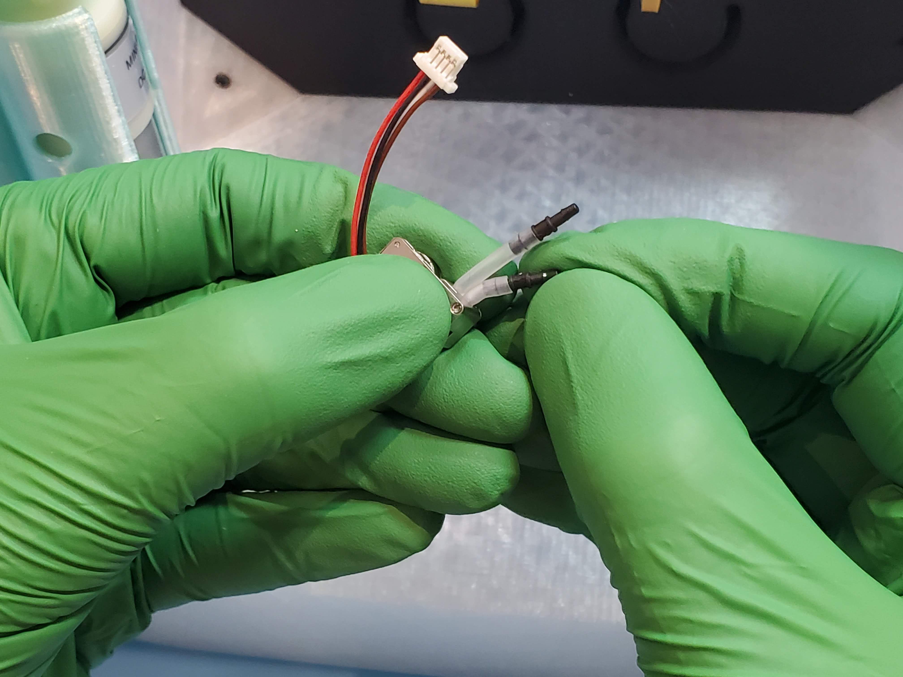
** pic stepper motor to connector to ribbon

## Prepare sheath (vacuum) pump assembly  {pagestep}

If building the Cytkit 1S-1F, first cut 2 x 200 mm wires for positive and neutral connections to the vacuum pump. Solder on end of each to the vacuum pump terminals. Leave the other ends as bare wire to connect to the screw terminals of the motor controller. 

>i If building the Cytkit 2S-14F configuration, the vacuum pump is already supplied with the correct length of wires and a connector to attach to the main board

** pic sheath pump assembly

## Prepare and attach tubing  {pagestep}

Cut the following lengths of silicone tubing and connect them as described below: 

1. Sample pump to flow cell sample inlet: 20 mm of OD 2 mm ID 1 mm silicone tubing
2. SIP tube to sample pump: 55 mm of OD 2 mm ID 1 mm silicone tubing
3. Flow cell waste outlet 120mm of OD 2 mm ID 1 mm silicone tubing

- 20 mm (peristaltic pump to flow cell sheath inlet)
- 55 mm (SIP tube to pump), 
- 700 mm (

vac tube 90mm 6x4mm tube + barb + 22mm 3.2x1.6mm tube
vacuum sensor 400mm
sheath tube 250mm 6x4 tube + barb + 470mm 2x1 tube
waste tube  2x1mm tube

*** pic fluidics after

## Attach fluidics system to instrument {pagestep}

## Attach fan holder and sheath pump holder to stand {pagestep}

*** pics fluidics mounted