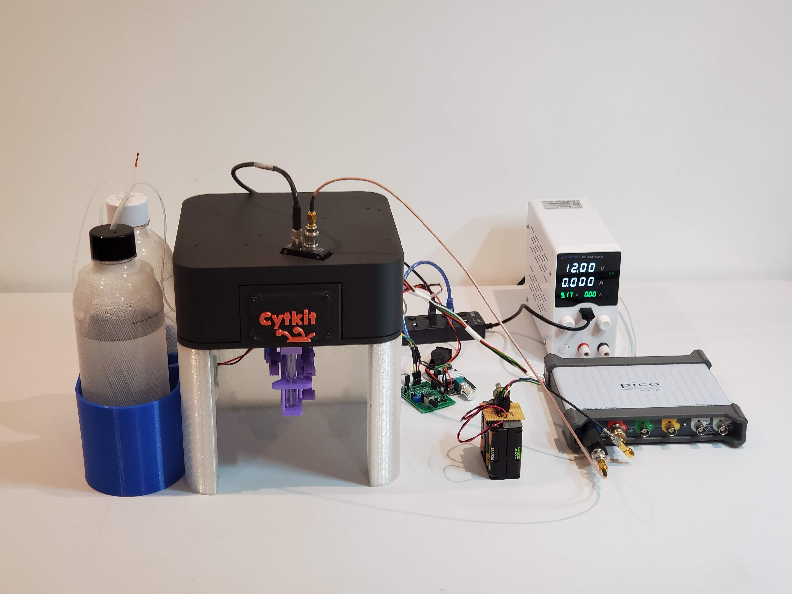
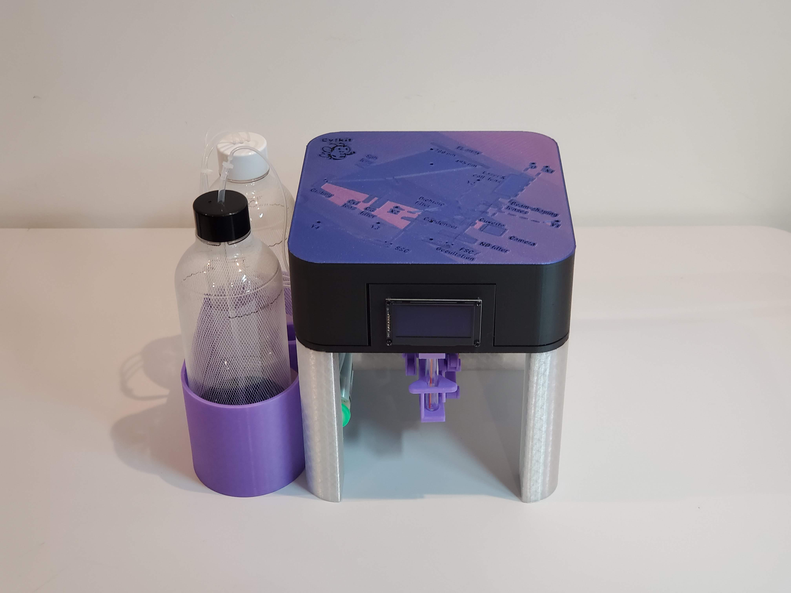

# Cytkit

Cytkit is an open-source spectral cytometer. You can make your own, either from a kit or by sourcing all the parts yourself. All mechanical parts are designed to be 3D-printed. You can also study and modify the design in free software (FreeCAD, with an ray-tracing optical model in the FreeCAD Optical Workbench).

The Cytkit instrument comprises: one laser, beam-shaping optics, a fluidic system with sheath flow and pumps for sample and sheath, optics for collecting and filtering emitted light, a dispersion element to split the emission into a spectrum, and [flexural degrees of freedom](https://doi.org/10.1364/BOE.385729) to align the laser beam and align the emission to detectors. 
 
# Cytkit configurations

You can configure your Cytkit with various detectors and acquisition electronics. These instructions cover two configurations as follows. 

## Cytkit 1S-1F

This is the 1-scatter 1-fluorescence configuration, which uses electronics from test equipment vendors: 1 x amplified photodiode ([Thorlabs PDA10](components/thorlabs_pda10.md){qty:1, cat:electronics1S1F}), 1 x PMT ([Hamamatsu H10732](components/hamamatsu_H10732.md){qty:1, cat:electronics1S1F}, 1 x USB oscilloscope ([Picoscope 5000 Series](components/picoscope.md){qty:1, cat:electronics1S1F}), as well as separate boards for motor control, and power supplies. 

>i Note that 1 fluorescence detector is pretty minimal for a spectral system, to make an understatement! (At least you can mount it at a wavelength of your choice.) Moreover, the USB oscilloscope can only transfer a low rate of events. This configuration is intended as an demonstration for education and technology development, rather than as a useful cytometer.

## Cytkit 2S-14F 

This is the 2-scatter 14-fluorescence configuration, which uses the [Astute Devices Cytometry Electronics Kit](components/cytometry_electronics_kit.md){qty:1, cat:electronics2S14F} (2x photodiode board, 1x SiPM array board, 1x main board, 1x pump connector board, 2x interlock switches, 1x blower fan, 1x OLED display, 1x power supply, 1x set of cables). 

This configuration is intended as an easy way to build your own fully functional spectral cytometer. 

>i The Astute Devices Cytometry Electronics Kit is in development and anticipated to be released in Q4 2026.

# Safety first

>!! Cytkit uses a Class 3B laser (a 488 nm laser diode with output power of approximately 25 mW). This is hazardous to the eyes. We strenuously advise you to have laser safety training before building your own Cytkit. 

Suitable laser safety glasses that block 488 nm light are included in the bill of materials.

At no point should you switch on the laser unless it is contained within the main body of the Cytkit instrument with the beam blocked by the FSC detector.

The coarse alignment step in the build instructions requires working with an exposed beam (cover off). You should take safety precautions for this step: 

* check for stray reflections 
* wear laser safety goggles that block 488 nm light 
* ensure that no other people are likely to be exposed to the laser, for example by being in the same environment. 

The fine alignment and operational use of the instrument are with the beam enclosed (cover on). 

Two interlocks are provided in the Astute Devices Cytometry Electronics Kit to switch off the laser if the cover is removed.

# Build Instructions

You will need the parts according to the [bill of materials]{BOM} according to which configuration you are building. You will also need the following tools:

* a set of Allen/hex keys
* a set of precision screwdrivers

Unless you have purchased a kit, you will need the following in addition:

* an FDM 3D printer (for almost all mechanical parts)
* a resin 3D printer (for a few precision parts including fluidic sealing parts)

To align and test the instrument, you will need:

* bright fluorescein beads 5 um diameter (or any size less than 20 um) 
* rainbow calibration beads (e.g. Spherotech RCP-30-5A or Bangs Quantum 8-Peak)
* fluorescein solution (optional)

1. [Print the mechanical parts](print_parts.md){step}
1. [Source the remaining components](source_parts.md){step}
1. [Assemble the mechanical parts](assemble.md){step}
1. [Assemble the fluidics](assemble_fluidics.md){step}
1. [Assemble the optics](assemble_optics.md){step}
1. [Install the electronics](electronics.md){step}
1. [Install and run the software](software.md){step}
1. [Coarse alignment](coarse_alignment.md){step}
1. [Fine alignment](fine_alignment.md){step}
1. [Test your Cytkit cytometer](test_cytometer.md){step}

