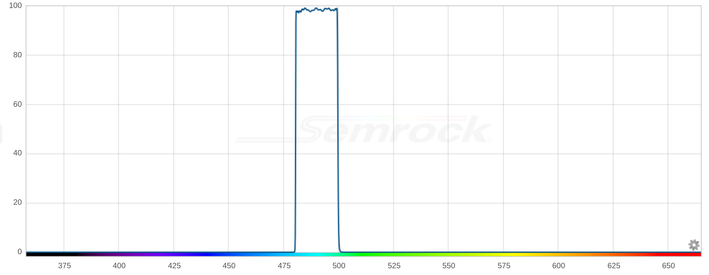

---
PartData:
    Specs:
        band pass: 490/15 nm
        overall size: 12.5 mm square
    Suppliers:
        Semrock:
            PartNo: FBP01-490/15-12.5
            Link: 'https://www.idex-hs.com/store/product-detail/fbp01_490_15_12_5?cat_id=semrock_optical_filters&node=individual_optical_filters'
---
# Band pass dichroic filter

490/15 nm single-band bandpass filter, 12.5 mm square

