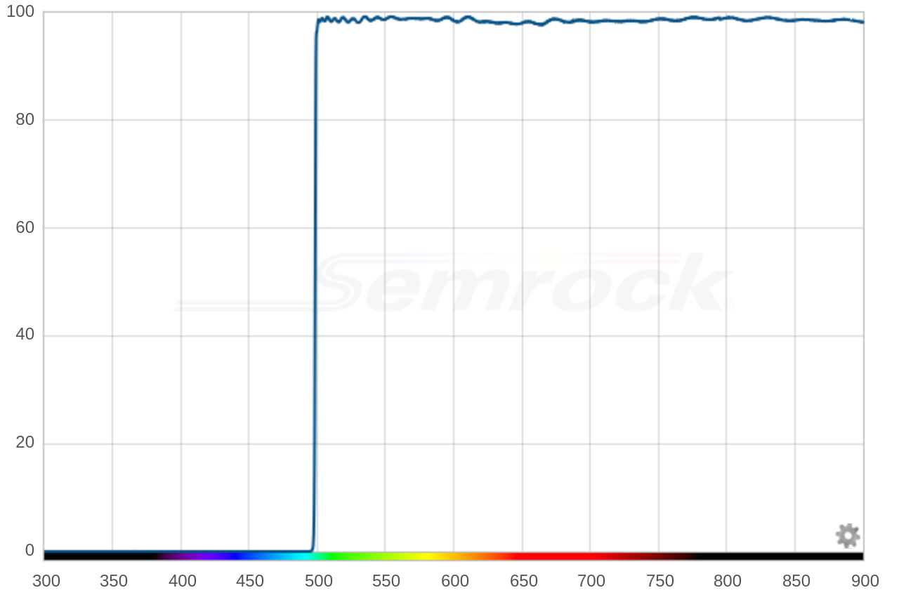

---
PartData:
    Specs:
        Edge: between 490 and 500 nm
        Optical density at 488 nm: at least 4; preferably > 6
        Transmission at 500 nm: preferably > 90% 
        Diameter: 25 mm (holders also available for 34 mm circular and 25.5x36 mm rectangular)
    Suppliers:
        Semrock:
            PartNo: BLP01-488R-25
            Link: 'https://www.idex-hs.com/store/product-detail/blp01_488r_25'
        Edmund Optics:
            PartNo: '#62-983'
            Link: 'https://www.edmundoptics.com/p/500nm-25mm-dia-high-performance-longpass-filter/17600/'

---
# Dichroic longpass filter at 0 degrees

This filter is the most important barrier to stop the laser light getting into the fluorescence detectors, while being as transparent as possible to the fluorescence emissions as close to the laser line as possible. There is a significant price difference between the best dichroic longpass filters and the mediocre ones. To resolve fluorophores such as GFP, BB515 and FITC whose emissions are close to the laser line, buy a filter that is substantially transparent at wavelengths > 500 nm. To avoid loss of sensitivity, optical density should be up to 6 at 488 nm. 

