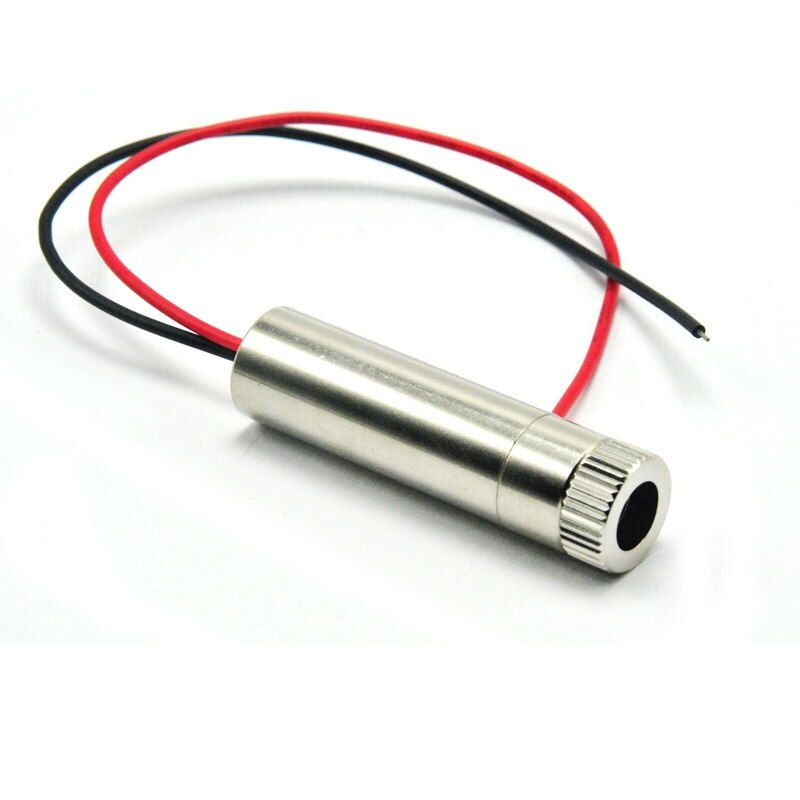

---
PartData:
    Specs:
        Outer diameter: 12 mm
        Length: min 30 mm, max 50 mm
        Power output: 25 mW recommended
        Voltage input: 5 V
    Suppliers:
        Aliexpress:
            PartNo: Search for "488 nm laser module 12 mm"
            Link: 'https://www.aliexpress.com/w/wholesale-488-nm-laser-12-mm.html'
        Amazon:
            PartNo: Search for "488 nm laser module 12 mm"
            Link: 'https://www.amazon.com/s?k=488+nm+laser+module+12+mm'

---
# 488 nm Laser Module

A wide variety of low cost 488 nm laser diode modules are available from quality suppliers and also the online marketplaces. 

Make sure it is a 12 mm diameter cylindrical module, and comes with a constant current driver with 5 V input. and an M9x0.5mm internal thread for mounting a collimating lens.

If buying a cheap laser module, rather than using the collimating lens that may come with the module, we will use the recommended high-NA collimating lens.

