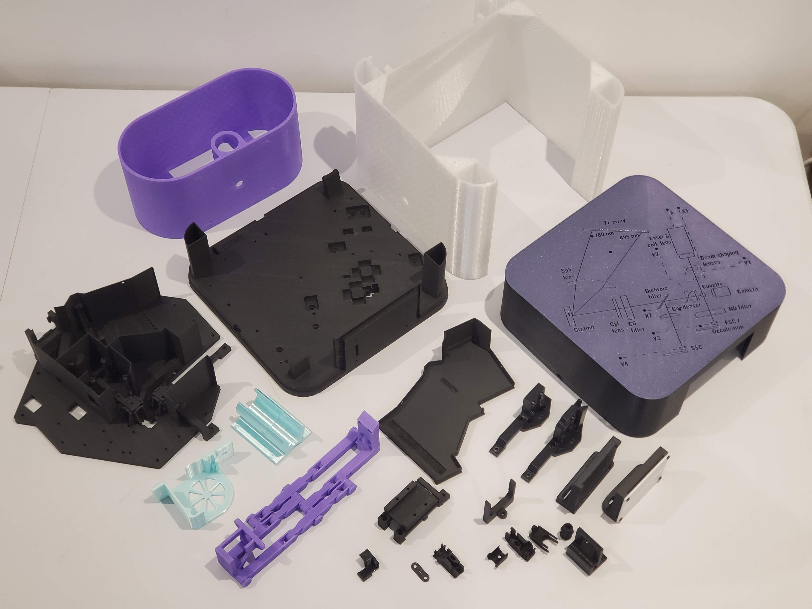

# Print the mechanical parts

Almost all the mechanical parts of the Cytkit are 3D printed, which you can do yourself from the STL files provided in the repo. Most parts require a consumer-grade FDM 3D printer with a 220x220mm print bed. A few parts however require a resin printer, for fine detail and fluidic sealing. 

>i A couple of days of 3D printing is required to build a Cytkit, and both an FDM and a resin printer. We intend to supply full kits shortly to make it easier to get started with Cytkit.

# FDM parts

## Matt black PLA parts

The following parts should be printed in matt black PLA. Their blackness is important for absorption of stray light. Their rigidity is important to keep a fixed alignment. Any PLA variant that is rigid and very matt will do, e.g. Ultra PLA.

1. [Main body](printed/main_body.md){qty:1, cat:printed}
1. [Base](printed/base.md){qty:1, cat:printed}
1. [Laser holder](printed/laser_holder.md){qty:1, cat:printed}
1. [Holder SiPM board](printed/holder_sipm_board.md){qty:1, cat:printed}

For the Cytkit 1S-1F configuration:

1. [Fluorescence compartment cap for PMT](printed/fluorescence_compartment_cap_pmt.md){qty:1, cat:printed1S1F}
1. [Amplified PD holder](printed/Amplified_PD_holder.md){qty:1, cat:printed1S1F}
1. [PMT mount base](printed/PMT_mount_base.md){qty:1, cat:printed1S1F}
1. [PMT mount](printed/PMT_mount.md){qty:1, cat:printed1S1F}
1. [Cover (with cable holes)](printed/Cover_with_cable_holes.md){qty:1, cat:printed1S1F}

For the Cytkit 2S-14F configuration:

1. [Fluorescence compartment cap](printed/fluorecence_compartment_cap.md){qty:1, cat:printed2S14F}
1. [PD board holder (h-adjust)](printed/pd_holder_h.md){qty:1, cat:printed2S14F}
1. [FSC v-slit 0.4mm](printed/fsc_v_slit.md){qty:1, cat:printed2S14F}
1. [PD board holder (v-adjust h-slit)](printed/pd_board_holder_v.md){qty:1, cat:printed2S14F}
1. [ND filter holder for FSC](printed/nd_filter_holder.md){qty:1, cat:printed2S14F}
1. [Holder SiPM board](printed/holder_sipm_board.md){qty:1, cat:printed} (print an additional one to the one listed above)
1. [Cover (with optics diagram)](printed/cover_with_optics_diagram.md){qty:1, cat:printed1S1F}

>i Note that the Cover (with optics diagram) can be printed with a couple of external layers in a different colour, for decoration and for better contrast in visualising the optics diagram.

## Black PLA+ parts

The following parts should also be rigid and black, but require a bit more flexibility to hold optics firmly or allow flexural degrees of freedom. Therefore PLA+ is recommended.

1. [Focusing lens holders](printed/foc_lens_holder.md){qty:1, cat:printed}
1. [Condensing lens holder](printed/condensing_lens_holder.md){qty:1, cat:printed}
1. [Correction cylindrical lens holder](printed/correction_cyl_lens_holder.md){qty:1, cat:printed}
1. [Camera mount v-adjust](printed/camera_mount_v_adjust.md){qty:1, cat:printed}

## White PLA parts

The following part must be printed in white as it is a tool for seeing the spectrum in coarse alignment:

1. [FL screen](printed/fl_screen.md){qty:1, cat:printed}

## Any-colour-you-like parts (PLA+ recommended)

The following parts do not interfere with the optics, and therefore can be printed in any colour you like. PLA+ is recommended for toughness, ridigity and accuracy.

1. [Sample loader](printed/sample_loader.md){qty:1, cat:printed}
1. [Sample pump holder](printed/sample_pump.md){qty:1, cat:printed}

For the Cytkit 1S-1F configuration:

1. [Front panel logo](printed/front_panel_logo.md){qty:1, cat:printed1S1F}

## Tough parts (PETG recommended)

The following parts can be printed in any colour. PETG is recommended for toughness and durability.

1. [Stand](printed/stand.md){qty:1, cat:printed}
1. [Fluidics cart](printed/fluidics_cart.md){qty:1, cat:printed}
1. [Rear panel cover](printed/rear_panel_cover.md){qty:1, cat:printed}

## Flexible parts (TPU recommended)

The following parts can be printed in any colour. TPU is recommended to absorb noise and vibration.

1. [Sheath pump holder](printed/sheath_pump_holder.md){qty:1, cat:printed}
1. [Fan holder](printed/fan_holder.md){qty:1, cat:printed}

# Resin parts

The following parts should all be printed using a resin printer (e.g. an LCD printer) in black resin (e.g. ABS-like black resin). The resin print has much higher resolution than FDM and allows proper sealing of fluidic parts as well as accurate printing of fine threads.

1. [Sheath chamber](printed/sheath_chamber.md){qty:1, cat:printed_resin}
1. [Laser collimating lens lock nut](printed/lock_nut.md){qty:1, cat:printed_resin}
1. [Laser collimating lens lock nut adjustment tool (short)](printed/lock_nut_tool_short.md){qty:1, cat:printed_resin}
1. [Laser collimating lens lock nut adjustment tool (long)](printed/lock_nut_tool_long.md){qty:1, cat:printed_resin}
1. [Camera tube lens](printed/camera_tube_lens.md){qty:1, cat:printed_resin}