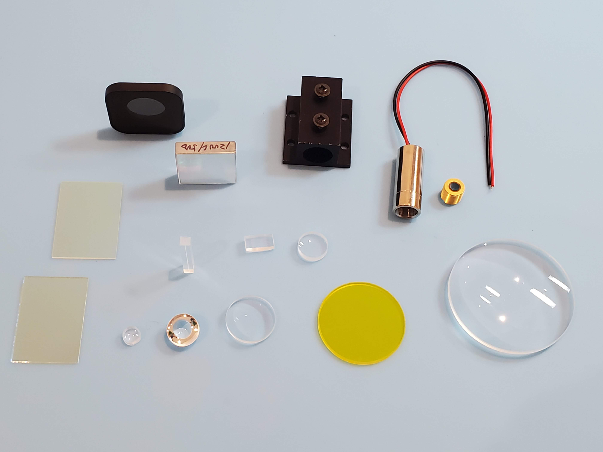
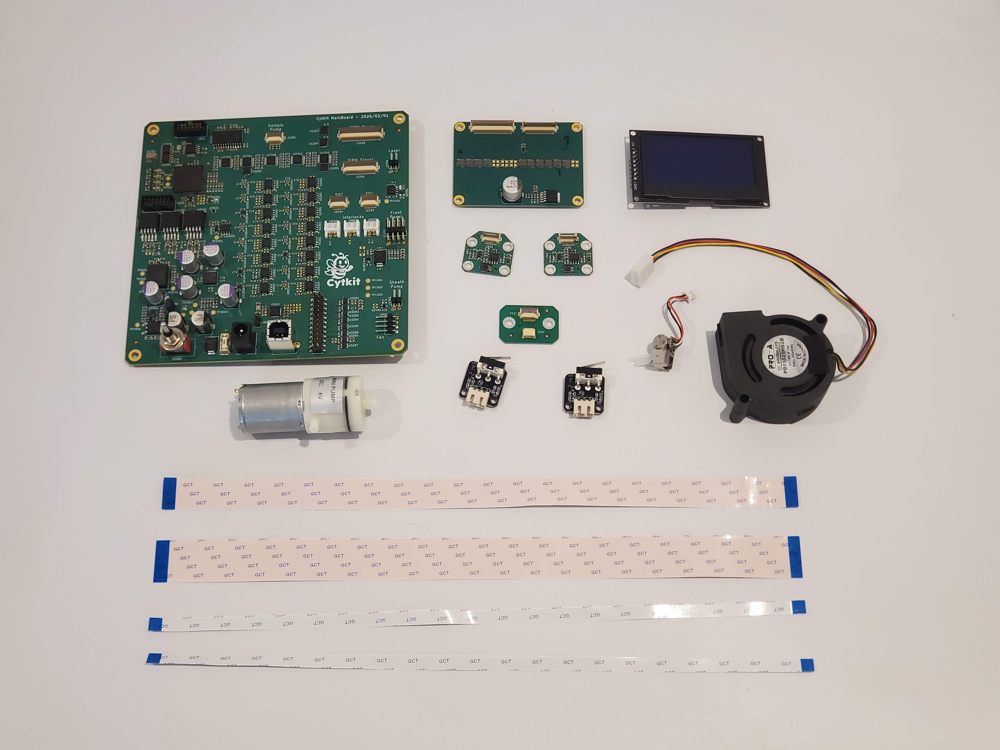
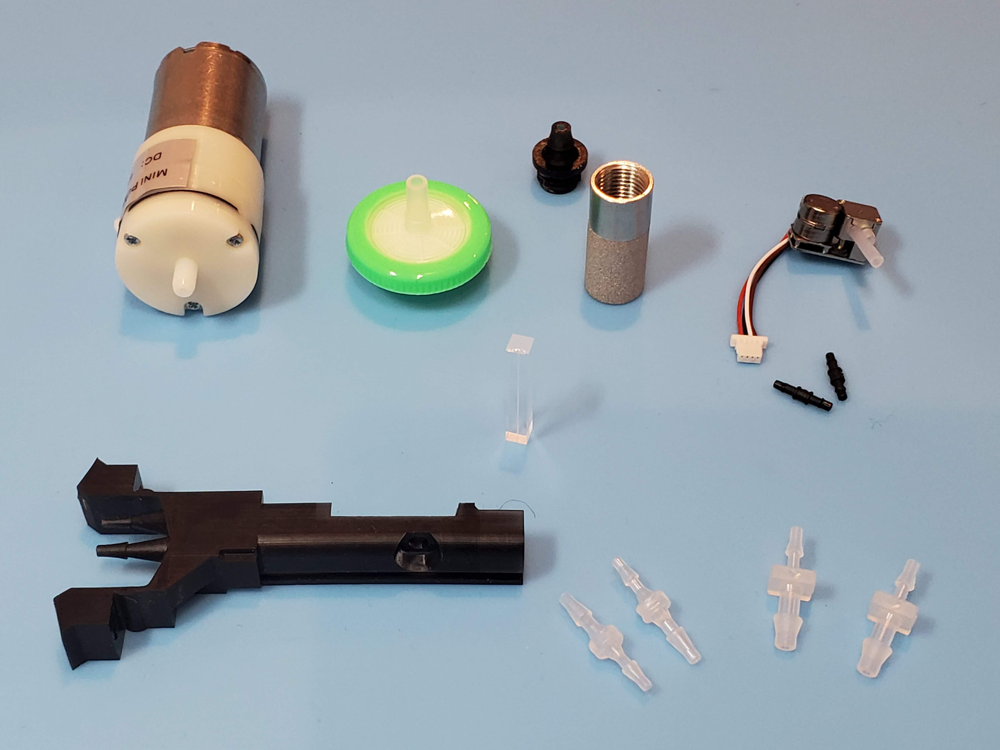

# Source the remaining components

Apart from the 3D printed parts, Cytkit requires a set of optical, electronic and fluidic components. These are listed below along with recommended sources.

>i We intend to supply full kits shortly, with all recommended components, to make it easier to get started with Cytkit.

## Source the safety equipment

1. [Laser safety glasses](safety/laser_safety_glasses.md){qty:1, cat:safety}

## Source the optical components

1. [Laser focus lens spherical](optical/laser_focus_lens_spherical.md){qty:1, cat:optics}
1. [Laser focus lens cylindrical](optical/laser_focus_lens_cylindrical.md){qty:1, cat:optics}
1. [Blazed reflection grating](optical/blazed_reflection_grating.md){qty:1, cat:optics}
1. [Neutral density filter](optical/nd_filter.md){qty:1, cat:optics}
1. [Dichroic longpass filter at 45 degrees](optical/dichroic_longpass_45.md){qty:1, cat:optics}
1. [Dichroic longpass filter at 0 degrees](optical/dichroic_longpass.md){qty:1, cat:optics}
1. [Coloured glass longpass filter](optical/coloured_glass_longpass.md){qty:1, cat:optics}
1. [Condensing lens](optical/condensing_lens.md){qty:1, cat:optics}
1. [Spectrum focusing lens](optical/spectrum_focusing_lens.md){qty:1, cat:optics}
1. [SSC focusing lens](optical/ssc_focusing_lens.md){qty:1, cat:optics}
1. [F7D8 aspherical lens](optical/F7D8_aspherical_lens.md){qty:2, cat:optics}
1. [488 nm laser module](optical/laser_module.md){qty:1, cat:optics}
1. [Laser collimating lens](optical/laser_collimating_lens.md){qty:1, cat:optics}
1. [Laser heatsink](optical/laser_heatsink.md){qty:1, cat:optics}
1. [Band pass dichroic filter](optical/band_pass_dichroic.md){qty:1, cat:optics}
1. [Cylindrical correction lens](optical/cylindrical_correction_lens.md){qty:1, cat:optics}

## Source the fluidic components

1. [Vacuum pump for sheath](fluidic/sheath_pump.md){qty:1, cat:fluidics}
1. [Peristaltic pump for sample](fluidic/sample_pump.md){qty:1, cat:fluidics}
1. [Bottom-of-bottle filter](fluidic/bottom_of_bottle_filter.md){qty:1, cat:fluidics}
1. [Filter adapter](fluidic/filter_adapter.md){qty:1, cat:fluidics}
1. [Silicone tubing 1 mm ID](fluidic/silicone_tubing_1mm.md){qty:1, cat:fluidics}
1. [Silicone tubing 4 mm ID](fluidic/silicone_tubing_4mm.md){qty:1, cat:fluidics}
1. [Tube barb union](fluidic/tube_barb_union.md){qty:2, cat:fluidics}
1. [Tube barb union (small)](fluidic/tube_barb_union_small.md){qty:2, cat:fluidics}
1. [Cuvette](fluidic/cuvette.md){qty:1, cat:fluidics}

## Source the electronic components

For the Cytkit 1S-1F configuration:

1. [Amplified photodiode (Thorlabs PDA10)](components/thorlabs_pda10.md){qty:1, cat:electronics1s1f}
1. [Photomultiplier tube module (Hamamatsu H10732)](components/hamamatsu_H10732.md){qty:1, cat:electronics1s1f}
1. [USB oscilloscope (Picoscope 5000 series)](components/picoscope.md){qty:1, cat:electronics1s1f}
1. [Diaphragm pump controller board](electronic/diaphragm_pump_controller.md){qty:1, cat:electronics1s1f}
1. [Stepper motor controller board](electronic/stepper_controller.md){qty:1, cat:electronics1s1f}
1. [Powered USB hub with individual switches](electronic/powered_hub.md){qty:1, cat:electronics1s1f}
1. [USB power cables](electronic/usb_power_cables.md){qty:3, cat:electronics1s1f}
1. [BNC (Male) to BNC (Male) cable, 1 m](electronic/bnc_cable.md){qty:1, cat:electronics1s1f}
1. [SMA (Female) to BNC (Male) adapter](electronic/sma_bnc_adapter.md){qty:1, cat:electronics1s1f}
1. [Linear Power Supply](electronic/linear_power_supply.md){qty:1, cat:electronics1s1f}

For the Cytkit 2S-14F configuration:

>i All electronic components are available in the Astute Devices Cytometry Electronics Set CYKIT-E-1, or in the Cytkit Full Kit CYKIT-K-1, anticipated to launch Q4 2026.

1. [Cytometer control board](electronic/cytometer_control_board.md){qty:1, cat:electronics2s14f}
1. [Photodiode board](electronic/photodiode_board.md){qty:2, cat:electronics2s14f} x2
1. [SiPM array board](electronic/sipm_array_board.md){qty:1, cat:electronics2s14f}
1. [Pump connector board](electronic/pump_connector_board.md){qty:1, cat:electronics2s14f}
1. [Interlock switches](electronic/interlock_switches.md){qty:2, cat:electronics2s14f} x2
1. [OLED display](electronic/oled_display.md){qty:1, cat:electronics2s14f}
1. [Blower fan](electronic/blower_fan.md){qty:1, cat:electronics2s14f}
1. [Ribbon connector set](electronic/ribbon_connectors.md){qty:1, cat:electronics2s14f}
1. [36V DC power supply](electronic/36v_dc_power_supply.md){qty:1, cat:electronics2s14f}
1. [USB A to USB B cable](electronic/usb_a_to_b_cable.md){qty:1, cat:electronics2s14f}

## Source the mechanical components

1. [M3 self-tapping hex socket cap screws 25 mm](mechanical/screws.yaml#self_tapping_m3x25_hex_socket){qty:1, cat:mechanics}
1. [M3 self-tapping posi head screws 6 mm](mechanical/screws.yaml#self_tapping_m3x6_posi){qty:1, cat:mechanics}
1. [M3 self-tapping posi head screws 8 mm](mechanical/screws.yaml#self_tapping_m3x8_posi){qty:1, cat:mechanics}
1. [M3 self-tapping posi head screws 10 mm](mechanical/screws.yaml#self_tapping_m3x10_posi){qty:1, cat:mechanics}
1. [M3 self-tapping posi head screws 12 mm](mechanical/screws.yaml#self_tapping_m3x12_posi){qty:1, cat:mechanics}
1. [M3 self-tapping posi head screws 16 mm](mechanical/screws.yaml#self_tapping_m3x16_posi){qty:1, cat:mechanics}
1. [M3 washers](mechanical/screws.yaml#m3_washers){qty:1, cat:mechanics}
1. [Stainless steel springs, 0.5 mm wire, 20 mm length, 6 mm diameter](mechanical/springs_20x6x0.5mm.md){qty:1, cat:mechanics}
1. [M4 thumb screws 10mm](mechanical/m4_thumb_screws.md){qty:3, cat:mechanics}
